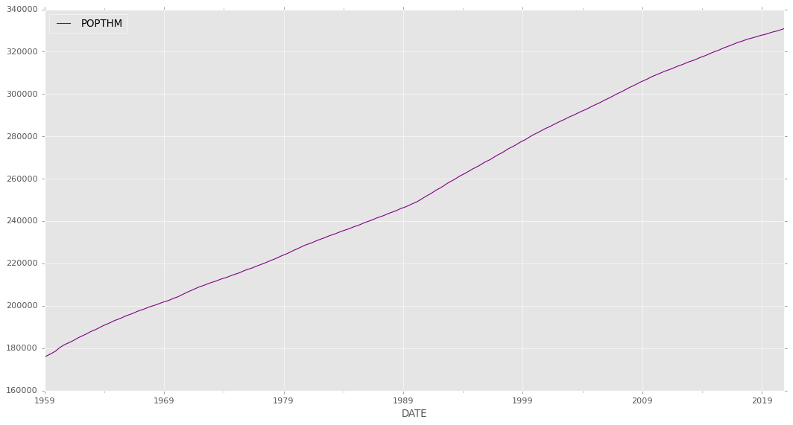
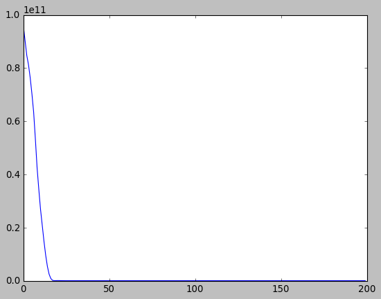

# LSTM (Long Short-Term Memory networks) Models for Time Series Forecasting

1. Univariate time series forecasting
2. Multivariate time series forecasting
3. Multi-step time series forecasting
4. Multivariate Multi-Step time series forecasting

## 1. Univariate time series forecasting LSTM models
###  i) Vanilla LSTM
###  ii) Stacked LSTM
###  iii) Bidirectional LSTM
###  iv) CNN LSTM
###  v) ConvLSTM

Each of these models are demonstrated for one-step univariate time series forecasting, but can easily be adapted and used as the input part of a model for other types of time series forecasting problems.

### Dataset

U.S. Bureau of Economic Analysis, Population [POPTHM], retrieved from FRED, Federal Reserve Bank of St. Louis; https://fred.stlouisfed.org/series/POPTHM, January 7, 2021.

This is a dataset from the U.S. Census Bureau hosted by the Federal Reserve Economic Database (FRED). Population includes resident population plus armed forces overseas. The monthly estimate is the average of estimates for the first of the month and the first of the following month.
BEA Account Code: B230RC

Observation:Nov 2020: 330,829
Updated: Dec 23, 2020
Units: Thousands, Not Seasonally Adjusted
Frequency: Monthly


```python
import pandas as pd
import numpy as np

df1 = pd.read_csv('POPTHM.csv', index_col=0)
print(df1.columns)
print(df1.index)
df1.head()
```

    Index(['POPTHM'], dtype='object')
    Index(['1/1/1959', '2/1/1959', '3/1/1959', '4/1/1959', '5/1/1959', '6/1/1959',
           '7/1/1959', '8/1/1959', '9/1/1959', '10/1/1959',
           ...
           '2/1/2020', '3/1/2020', '4/1/2020', '5/1/2020', '6/1/2020', '7/1/2020',
           '8/1/2020', '9/1/2020', '10/1/2020', '11/1/2020'],
          dtype='object', name='DATE', length=743)
    


<div>
<style scoped>
    .dataframe tbody tr th:only-of-type {
        vertical-align: middle;
    }

    .dataframe tbody tr th {
        vertical-align: top;
    }

    .dataframe thead th {
        text-align: right;
    }
</style>
<table border="1" class="dataframe">
  <thead>
    <tr style="text-align: right;">
      <th></th>
      <th>POPTHM</th>
    </tr>
    <tr>
      <th>DATE</th>
      <th></th>
    </tr>
  </thead>
  <tbody>
    <tr>
      <th>1/1/1959</th>
      <td>175818</td>
    </tr>
    <tr>
      <th>2/1/1959</th>
      <td>176044</td>
    </tr>
    <tr>
      <th>3/1/1959</th>
      <td>176274</td>
    </tr>
    <tr>
      <th>4/1/1959</th>
      <td>176503</td>
    </tr>
    <tr>
      <th>5/1/1959</th>
      <td>176723</td>
    </tr>
  </tbody>
</table>
</div>


```python
import datetime

# Convert index to DatetimeIndex type 
fixed_dates_df = df1.copy()
fixed_dates_df = fixed_dates_df.set_index(fixed_dates_df.index.to_series().apply(pd.to_datetime))

df1 = fixed_dates_df
print(df1.index)
df1.tail()
```

    DatetimeIndex(['1959-01-01', '1959-02-01', '1959-03-01', '1959-04-01',
                   '1959-05-01', '1959-06-01', '1959-07-01', '1959-08-01',
                   '1959-09-01', '1959-10-01',
                   ...
                   '2020-02-01', '2020-03-01', '2020-04-01', '2020-05-01',
                   '2020-06-01', '2020-07-01', '2020-08-01', '2020-09-01',
                   '2020-10-01', '2020-11-01'],
                  dtype='datetime64[ns]', name='DATE', length=743, freq=None)
    


<div>
<style scoped>
    .dataframe tbody tr th:only-of-type {
        vertical-align: middle;
    }

    .dataframe tbody tr th {
        vertical-align: top;
    }

    .dataframe thead th {
        text-align: right;
    }
</style>
<table border="1" class="dataframe">
  <thead>
    <tr style="text-align: right;">
      <th></th>
      <th>POPTHM</th>
    </tr>
    <tr>
      <th>DATE</th>
      <th></th>
    </tr>
  </thead>
  <tbody>
    <tr>
      <th>2020-07-01</th>
      <td>330199</td>
    </tr>
    <tr>
      <th>2020-08-01</th>
      <td>330368</td>
    </tr>
    <tr>
      <th>2020-09-01</th>
      <td>330535</td>
    </tr>
    <tr>
      <th>2020-10-01</th>
      <td>330692</td>
    </tr>
    <tr>
      <th>2020-11-01</th>
      <td>330829</td>
    </tr>
  </tbody>
</table>
</div>


```python
import matplotlib.pyplot as plt
from pandas.plotting import register_matplotlib_converters
register_matplotlib_converters()
plt.style.use("ggplot")
plt.rcParams['figure.figsize'] = [16, 8]

df1.plot(color="purple")
```


    <AxesSubplot:xlabel='DATE'>





```python
# Split train, test data
# Since this is a single step forecast, only the last index is removed from training dataset
train_seq1 = df1[-201:-1]['POPTHM'] # LSTM perform best between 200 ~ 400 datapoint
test_seq1 = df1.iloc[-1]['POPTHM']
print(type(train_seq1))
print("Shape of dataset: ", train_seq1.shape)
print("train", train_seq1.tail())
print("test", test_seq1)
```

    <class 'pandas.core.series.Series'>
    Shape of dataset:  (200,)
    train DATE
    2020-06-01    330038
    2020-07-01    330199
    2020-08-01    330368
    2020-09-01    330535
    2020-10-01    330692
    Name: POPTHM, dtype: int64
    test 330829
    

### Data Preprocessing

##### The LSTM model will learn a function that maps a sequence of past observations as input to an output observation. As such, the sequence of observations must be transformed into multiple examples from which the LSTM can learn.


```python
from numpy import array

# split a univariate sequence into samples
def split_sequence(sequence, n_steps):
    x, y = list(), list()
    for i in range(len(sequence)):
        # find the end of this pattern
        end_ix = i + n_steps
        # check if we are beyond the sequence
        if end_ix > len(sequence)-1:
            break
        # gather input and output parts of the pattern
        seq_x, seq_y = sequence[i:end_ix], sequence[end_ix]
        x.append(seq_x)
        y.append(seq_y)
    return array(x), array(y) # x = [samples, timesteps]
```


```python
# Splits the univariate series into six samples where each sample has three input time steps and one output time step.
input_sequence = train_seq1 # Training dataset

# choose a number of time steps
n_steps = 3

# split into samples
x, y = split_sequence(input_sequence, n_steps)

# summarize the databb
for i in range(len(x)):
	print(x[i], y[i])

n_features = 1 # univariate
# reshape from [samples, timesteps] into [samples, timesteps, features]
x = x.reshape((x.shape[0], x.shape[1], n_features))
```

    [292434 292651 292872] 293103
    [292651 292872 293103] 293350
    [292872 293103 293350] 293603
    [293103 293350 293603] 293857
    [293350 293603 293857] 294104
    [293603 293857 294104] 294337
    [293857 294104 294337] 294561
    [294104 294337 294561] 294768
    [294337 294561 294768] 294955
    [294561 294768 294955] 295149
    [294768 294955 295149] 295359
    [294955 295149 295359] 295582
    [295149 295359 295582] 295824
    [295359 295582 295824] 296077
    [295582 295824 296077] 296338
    [295824 296077 296338] 296606
    [296077 296338 296606] 296857
    [296338 296606 296857] 297089
    [296606 296857 297089] 297311
    [296857 297089 297311] 297526
    [297089 297311 297526] 297734
    [297311 297526 297734] 297950
    [297526 297734 297950] 298170
    [297734 297950 298170] 298401
    [297950 298170 298401] 298653
    [298170 298401 298653] 298910
    [298401 298653 298910] 299178
    [298653 298910 299178] 299452
    [298910 299178 299452] 299710
    [299178 299452 299710] 299950
    [299452 299710 299950] 300178
    [299710 299950 300178] 300398
    [299950 300178 300398] 300608
    [300178 300398 300608] 300823
    [300398 300608 300823] 301045
    [300608 300823 301045] 301278
    [300823 301045 301278] 301528
    [301045 301278 301528] 301790
    [301278 301528 301790] 302064
    [301528 301790 302064] 302334
    [301790 302064 302334] 302590
    [302064 302334 302590] 302834
    [302334 302590 302834] 303062
    [302590 302834 303062] 303280
    [302834 303062 303280] 303494
    [303062 303280 303494] 303707
    [303280 303494 303707] 303926
    [303494 303707 303926] 304157
    [303707 303926 304157] 304396
    [303926 304157 304396] 304646
    [304157 304396 304646] 304903
    [304396 304646 304903] 305158
    [304646 304903 305158] 305403
    [304903 305158 305403] 305620
    [305158 305403 305620] 305827
    [305403 305620 305827] 306035
    [305620 305827 306035] 306237
    [305827 306035 306237] 306438
    [306035 306237 306438] 306645
    [306237 306438 306645] 306863
    [306438 306645 306863] 307090
    [306645 306863 307090] 307322
    [306863 307090 307322] 307570
    [307090 307322 307570] 307826
    [307322 307570 307826] 308071
    [307570 307826 308071] 308289
    [307826 308071 308289] 308495
    [308071 308289 308495] 308706
    [308289 308495 308706] 308904
    [308495 308706 308904] 309095
    [308706 308904 309095] 309279
    [308904 309095 309279] 309457
    [309095 309279 309457] 309643
    [309279 309457 309643] 309847
    [309457 309643 309847] 310060
    [309643 309847 310060] 310280
    [309847 310060 310280] 310488
    [310060 310280 310488] 310677
    [310280 310488 310677] 310858
    [310488 310677 310858] 311023
    [310677 310858 311023] 311173
    [310858 311023 311173] 311333
    [311023 311173 311333] 311502
    [311173 311333 311502] 311678
    [311333 311502 311678] 311872
    [311502 311678 311872] 312077
    [311678 311872 312077] 312292
    [311872 312077 312292] 312509
    [312077 312292 312509] 312708
    [312292 312509 312708] 312889
    [312509 312708 312889] 313064
    [312708 312889 313064] 313227
    [312889 313064 313227] 313383
    [313064 313227 313383] 313546
    [313227 313383 313546] 313710
    [313383 313546 313710] 313883
    [313546 313710 313883] 314072
    [313710 313883 314072] 314272
    [313883 314072 314272] 314489
    [314072 314272 314489] 314703
    [314272 314489 314703] 314905
    [314489 314703 314905] 315092
    [314703 314905 315092] 315258
    [314905 315092 315258] 315400
    [315092 315258 315400] 315535
    [315258 315400 315535] 315682
    [315400 315535 315682] 315841
    [315535 315682 315841] 316016
    [315682 315841 316016] 316202
    [315841 316016 316202] 316405
    [316016 316202 316405] 316627
    [316202 316405 316627] 316846
    [316405 316627 316846] 317055
    [316627 316846 317055] 317248
    [316846 317055 317248] 317429
    [317055 317248 317429] 317598
    [317248 317429 317598] 317758
    [317429 317598 317758] 317924
    [317598 317758 317924] 318098
    [317758 317924 318098] 318284
    [317924 318098 318284] 318479
    [318098 318284 318479] 318692
    [318284 318479 318692] 318921
    [318479 318692 318921] 319149
    [318692 318921 319149] 319367
    [318921 319149 319367] 319561
    [319149 319367 319561] 319742
    [319367 319561 319742] 319904
    [319561 319742 319904] 320053
    [319742 319904 320053] 320215
    [319904 320053 320215] 320390
    [320053 320215 320390] 320574
    [320215 320390 320574] 320769
    [320390 320574 320769] 320982
    [320574 320769 320982] 321205
    [320769 320982 321205] 321428
    [320982 321205 321428] 321641
    [321205 321428 321641] 321834
    [321428 321641 321834] 322020
    [321641 321834 322020] 322196
    [321834 322020 322196] 322353
    [322020 322196 322353] 322513
    [322196 322353 322513] 322685
    [322353 322513 322685] 322867
    [322513 322685 322867] 323061
    [322685 322867 323061] 323265
    [322867 323061 323265] 323473
    [323061 323265 323473] 323680
    [323265 323473 323680] 323876
    [323473 323680 323876] 324052
    [323680 323876 324052] 324216
    [323876 324052 324216] 324362
    [324052 324216 324362] 324494
    [324216 324362 324494] 324632
    [324362 324494 324632] 324783
    [324494 324632 324783] 324944
    [324632 324783 324944] 325117
    [324783 324944 325117] 325296
    [324944 325117 325296] 325476
    [325117 325296 325476] 325653
    [325296 325476 325653] 325820
    [325476 325653 325820] 325968
    [325653 325820 325968] 326100
    [325820 325968 326100] 326216
    [325968 326100 326216] 326323
    [326100 326216 326323] 326437
    [326216 326323 326437] 326563
    [326323 326437 326563] 326699
    [326437 326563 326699] 326847
    [326563 326699 326847] 327005
    [326699 326847 327005] 327167
    [326847 327005 327167] 327328
    [327005 327167 327328] 327477
    [327167 327328 327477] 327607
    [327328 327477 327607] 327722
    [327477 327607 327722] 327824
    [327607 327722 327824] 327921
    [327722 327824 327921] 328025
    [327824 327921 328025] 328140
    [327921 328025 328140] 328267
    [328025 328140 328267] 328404
    [328140 328267 328404] 328561
    [328267 328404 328561] 328730
    [328404 328561 328730] 328897
    [328561 328730 328897] 329054
    [328730 328897 329054] 329191
    [328897 329054 329191] 329314
    [329054 329191 329314] 329423
    [329191 329314 329423] 329527
    [329314 329423 329527] 329638
    [329423 329527 329638] 329760
    [329527 329638 329760] 329894
    [329638 329760 329894] 330038
    [329760 329894 330038] 330199
    [329894 330038 330199] 330368
    [330038 330199 330368] 330535
    [330199 330368 330535] 330692
    


```python
from sklearn.metrics import mean_squared_error, mean_absolute_error
def model_eval(y, predictions):    
        # Mean absolute error (MAE)
        mae = mean_absolute_error(y, predictions)
    
        # Mean squared error (MSE)
        mse = mean_squared_error(y, predictions)
    
    
        # SMAPE is an alternative for MAPE when there are zeros in the testing data. It
        # scales the absolute percentage by the sum of forecast and observed values
        SMAPE = np.mean(np.abs((y - predictions) / ((y + predictions)/2))) * 100
    
    
        # Calculate the Root Mean Squared Error
        rmse = np.sqrt(mean_squared_error(y, predictions))
    
        # Calculate the Mean Absolute Percentage Error
        # y, predictions = check_array(y, predictions)
        MAPE = np.mean(np.abs((y - predictions) / y)) * 100
    
        # mean_forecast_error
        mfe = np.mean(y - predictions)
    
        # NMSE normalizes the obtained MSE after dividing it by the test variance. It
        # is a balanced error measure and is very effective in judging forecast
        # accuracy of a model.
    
        # normalised_mean_squared_error
        NMSE = mse / (np.sum((y - np.mean(y)) ** 2)/(len(y)-1))
    
    
        # theil_u_statistic
        # It is a normalized measure of total forecast error.
        error = y - predictions
        mfe = np.sqrt(np.mean(predictions**2))
        mse = np.sqrt(np.mean(y**2))
        rmse = np.sqrt(np.mean(error**2))
        theil_u_statistic =  rmse / (mfe*mse)
    
    
        # mean_absolute_scaled_error
        # This evaluation metric is used to over come some of the problems of MAPE and
        # is used to measure if the forecasting model is better than the naive model or
        # not.
    
        
        # Print metrics
        print('Mean Absolute Error:', round(mae, 3))
        print('Mean Squared Error:', round(mse, 3))
        print('Root Mean Squared Error:', round(rmse, 3))
        print('Mean absolute percentage error:', round(MAPE, 3))
        print('Scaled Mean absolute percentage error:', round(SMAPE, 3))
        print('Mean forecast error:', round(mfe, 3))
        print('Normalised mean squared error:', round(NMSE, 3))
        print('Theil_u_statistic:', round(theil_u_statistic, 3))
```

## Vanilla LSTM
 
#### Contains single hidden layer of LSTM units, and an output layer used to make a prediction.
#### Three-dimensiona model input = [samples, timesteps, features]


```python
from keras.models import Sequential
from keras.layers import LSTM
from keras.layers import Dense
n_features = 1 # univariate

# define model 
model = Sequential()
model.add(LSTM(200, activation='relu', input_shape=(n_steps, n_features))) # 50 LSTM units in the hidden layer
model.add(Dense(1))
model.compile(optimizer='adam', loss='mse') #  Adam version of stochastic gradient descent 

# fit model
history = model.fit(x, y, epochs=200, verbose=0)
plt.style.use('classic')
plt.plot(history.history["loss"])

# Prediction
x_input = input_sequence[-3:].to_numpy()
x_input = x_input.reshape((1, n_steps, n_features))
yhat = model.predict(x_input, verbose=1)

```

    1/1 [==============================] - 0s 2ms/step
    





```python
print("actual", array([[test_seq1]]))
print("prediction", yhat) # Expected ans: 2020-11-01	330829
```

    actual [[330829]]
    prediction [[330945.34]]
    


```python
model_eval(array([test_seq1]), yhat)
```

    Mean Absolute Error: 116.344
    Mean Squared Error: 330829.0
    Root Mean Squared Error: 116.344
    Mean absolute percentage error: 0.035
    Scaled Mean absolute percentage error: 0.035
    Mean forecast error: 330945.34
    Normalised mean squared error: nan
    Theil_u_statistic: 0.0
    

    D:\Users\Yuzhe\Anaconda3\envs\deeplearning\lib\site-packages\ipykernel_launcher.py:30: RuntimeWarning: invalid value encountered in double_scalars
    

 The forecast's distance from the true value is 0.037% of the true value, which is good as the forecast value is only off by 0.037%

# Stacked LSTM

#### Multiple hidden LSTM layers can be stacked one on top of another.


```python
n_steps = 3
n_features = 1 # univariate

# define model
model = Sequential()
model.add(LSTM(50, activation='relu', return_sequences=True, input_shape=(n_steps, n_features))) #3D output from hidden LSTM layer as input to the next.
model.add(LSTM(50, activation='relu'))
model.add(Dense(1))
model.compile(optimizer='adam', loss='mse')

# fit model
model.fit(x, y, epochs=200, verbose=0)

# demonstrate prediction
x_input = input_sequence[-3:].to_numpy()
x_input = x_input.reshape((1, n_steps, n_features))
yhat = model.predict(x_input, verbose=0)
print("actual", array([[test_seq1]]))
print("prediction", yhat) # Expected ans: 2020-11-01	330829
model_eval(array([test_seq1]), yhat)
```

    actual [[330829]]
    prediction [[330932.56]]
    Mean Absolute Error: 103.562
    Mean Squared Error: 330829.0
    Root Mean Squared Error: 103.562
    Mean absolute percentage error: 0.031
    Scaled Mean absolute percentage error: 0.031
    Mean forecast error: 330932.56
    Normalised mean squared error: nan
    Theil_u_statistic: 0.0
    

    D:\Users\Yuzhe\Anaconda3\envs\deeplearning\lib\site-packages\ipykernel_launcher.py:30: RuntimeWarning: invalid value encountered in double_scalars
    

## Bidirectional LSTM

#### LSTM model to learn the input sequence both forward and backwards and concatenate both interpretations.
#### Wrap the first hidden layer in a wrapper layer called Bidirectional.


```python
from keras.layers import Bidirectional

n_steps = 3
n_features = 1

# define model
model = Sequential()
model.add(Bidirectional(LSTM(50, activation='relu'), input_shape=(n_steps, n_features)))
model.add(Dense(1))
model.compile(optimizer='adam', loss='mse')

# fit model
model.fit(x, y, epochs=200, verbose=0)

# demonstrate prediction
x_input = input_sequence[-3:].to_numpy()
x_input = x_input.reshape((1, n_steps, n_features))
yhat = model.predict(x_input, verbose=0)
print("actual", array([[test_seq1]]))
print("prediction", yhat) # Expected ans: 2020-11-01	330829
model_eval(array([test_seq1]), yhat)
```

    actual [[330829]]
    prediction [[330937.7]]
    Mean Absolute Error: 108.688
    Mean Squared Error: 330829.0
    Root Mean Squared Error: 108.688
    Mean absolute percentage error: 0.033
    Scaled Mean absolute percentage error: 0.033
    Mean forecast error: 330937.7
    Normalised mean squared error: nan
    Theil_u_statistic: 0.0
    

    D:\Users\Yuzhe\Anaconda3\envs\deeplearning\lib\site-packages\ipykernel_launcher.py:30: RuntimeWarning: invalid value encountered in double_scalars
    

## CNN LSTM

#### CNN is used to interpret subsequences of input that together are provided as a sequence to an LSTM model to interpret


```python
from keras.layers import Flatten
from keras.layers import TimeDistributed
from keras.layers.convolutional import Conv1D
from keras.layers.convolutional import MaxPooling1D

n_steps = 4
# split into samples
x, y = split_sequence(input_sequence, n_steps)

# Each sample can then be split into two sub-samples, each with two time steps. 
# So the CNN can interpret each subsequence of two time steps and provide a 
# time series of interpretations of the subsequences to the LSTM model to process as input.
# reshape from [samples, timesteps] into [samples, subsequences, timesteps, features]
n_features = 1
n_seq = 2
n_steps = 2
x = x.reshape((x.shape[0], n_seq, n_steps, n_features))

# define model
model = Sequential()
# TimeDistributed wrapper to apply the entire model once per input subsequence 
# Reuse the same CNN model when reading in each sub-sequence of data separately
model.add(TimeDistributed(Conv1D(filters=64, kernel_size=1, activation='relu'), input_shape=(None, n_steps, n_features)))
model.add(TimeDistributed(MaxPooling1D(pool_size=2))) # distills the filter maps down to 1/2 of their size that includes the most salient features
model.add(TimeDistributed(Flatten())) # single input time step
model.add(LSTM(50, activation='relu')) 
model.add(Dense(1))
model.compile(optimizer='adam', loss='mse')

# fit model
model.fit(x, y, epochs=500, verbose=0)

# demonstrate prediction
x_input = input_sequence[-4:].to_numpy()
x_input = x_input.reshape((1, n_seq, n_steps, n_features))
yhat = model.predict(x_input, verbose=0)
print("actual", array([[test_seq1]]))
print("prediction", yhat) # Expected ans: 2020-11-01	330829
model_eval(array([test_seq1]), yhat)
```

    actual [[330829]]
    prediction [[330931.44]]
    Mean Absolute Error: 102.438
    Mean Squared Error: 330829.0
    Root Mean Squared Error: 102.438
    Mean absolute percentage error: 0.031
    Scaled Mean absolute percentage error: 0.031
    Mean forecast error: 330931.44
    Normalised mean squared error: nan
    Theil_u_statistic: 0.0
    

    D:\Users\Yuzhe\Anaconda3\envs\deeplearning\lib\site-packages\ipykernel_launcher.py:30: RuntimeWarning: invalid value encountered in double_scalars
    

## ConvLSTM

#### Convolutional reading of input is built directly into each LSTM unit
#### Developed for reading two-dimensional spatial-temporal data, but can be adapted for use with univariate time series forecasting


```python
from keras.layers import ConvLSTM2D

# choose a number of time steps
n_steps = 4

# split into samples
x, y = split_sequence(input_sequence, n_steps)

# reshape from [samples, timesteps] into [samples, timesteps, rows, columns, features]
# as the layer expects input as a sequence of two-dimensional images
n_features = 1
n_seq = 2
n_steps = 2
# timesteps = number of subsequences, or n_seq
# columns = number of time steps for each subsequence, or n_steps
# number of rows is fixed at 1 for one-dimensional data
x = x.reshape((x.shape[0], n_seq, 1, n_steps, n_features))

# define model
model = Sequential()
# two-dimensional kernel size in terms of (rows, columns)
model.add(ConvLSTM2D(filters=64, kernel_size=(1,2), activation='relu', input_shape=(n_seq, 1, n_steps, n_features)))
model.add(Flatten())
model.add(Dense(1))
model.compile(optimizer='adam', loss='mse')

# fit model
model.fit(x, y, epochs=500, verbose=0)

# demonstrate prediction
x_input = input_sequence[-4:].to_numpy()
x_input = x_input.reshape((1, n_seq, 1, n_steps, n_features))
yhat = model.predict(x_input, verbose=0)
print("actual", array([[test_seq1]]))
print("prediction", yhat) # Expected ans: 2020-11-01	330829
model_eval(array([test_seq1]), yhat)
```

    actual [[330829]]
    prediction [[330945.34]]
    Mean Absolute Error: 116.344
    Mean Squared Error: 330829.0
    Root Mean Squared Error: 116.344
    Mean absolute percentage error: 0.035
    Scaled Mean absolute percentage error: 0.035
    Mean forecast error: 330945.34
    Normalised mean squared error: nan
    Theil_u_statistic: 0.0
    

    D:\Users\Yuzhe\Anaconda3\envs\deeplearning\lib\site-packages\ipykernel_launcher.py:30: RuntimeWarning: invalid value encountered in double_scalars
    

## 2. Multivariate time series forecasting LSTM models
###    i) Multiple Input Series
###   ii) Multiple Parallel Series

Multivariate time series data means data where there is more than one observation for each time step.

## Data Preprocessing


```python
from numpy import hstack

# split a multivariate sequence into samples
# x component has a three-dimensional structure
def split_multi_seq(sequences, n_steps):
	x, y = list(), list()
	for i in range(len(sequences)):
		# find the end of this pattern
		end_ix = i + n_steps
		# check if we are beyond the dataset
		if end_ix > len(sequences):
			break
		# gather input and output parts of the pattern
		seq_x, seq_y = sequences[i:end_ix, :-1], sequences[end_ix-1, -1]
		x.append(seq_x)
		y.append(seq_y)
	return array(x), array(y)
```

## Multiple Input Series
Two or more parallel input time series and an output time series that is dependent on the input time series

## Dataset
Simple example of two parallel input time series where the output series is the simple addition of the input series.

eg
input:

10, 15

20, 25

30, 35

output:
65


```python
in_seq1 = array([10, 20, 30, 40, 50, 60, 70, 80, 90, 100])
in_seq2 = array([15, 25, 35, 45, 55, 65, 75, 85, 95, 105])
out_seq = array([in_seq1[i]+in_seq2[i] for i in range(len(in_seq1))])

# multivariate data preparation
# convert to [rows, columns] structure
in_seq1 = in_seq1.reshape((len(in_seq1), 1))
in_seq2 = in_seq2.reshape((len(in_seq2), 1))
out_seq = out_seq.reshape((len(out_seq), 1)) # output series

# horizontally stack columns
# each row is a time step, and each column is a separate time series
# standard way of storing parallel time series in a CSV file
dataset = hstack((in_seq1, in_seq2, out_seq))

# number of time steps
n_steps = 3
# convert into input/output
x, y = split_multi_seq(dataset, n_steps)

# x.shape = (number of samples, number of time steps per sample, number of parallel time series)
print(x.shape, y.shape)

# summarize the data (2 input series, output)
for i in range(len(x)):
	print(x[i], y[i])

```

    (8, 3, 2) (8,)
    [[10 15]
     [20 25]
     [30 35]] 65
    [[20 25]
     [30 35]
     [40 45]] 85
    [[30 35]
     [40 45]
     [50 55]] 105
    [[40 45]
     [50 55]
     [60 65]] 125
    [[50 55]
     [60 65]
     [70 75]] 145
    [[60 65]
     [70 75]
     [80 85]] 165
    [[70 75]
     [80 85]
     [90 95]] 185
    [[ 80  85]
     [ 90  95]
     [100 105]] 205
    


```python
# Split train, validation data
# Since this is a single step forecast, only the last index is removed from training dataset
train_x = x[:-1]
train_y = y[:-1]
valid_x = x[-1]
valid_y = y[-1]
print("train x", train_x[-5:])
print("train y", train_y[-5:])

print("Validation x", valid_x)
print("Validation y", valid_y)

```

    train x [[[30 35]
      [40 45]
      [50 55]]
    
     [[40 45]
      [50 55]
      [60 65]]
    
     [[50 55]
      [60 65]
      [70 75]]
    
     [[60 65]
      [70 75]
      [80 85]]
    
     [[70 75]
      [80 85]
      [90 95]]]
    train y [105 125 145 165 185]
    Validation x [[ 80  85]
     [ 90  95]
     [100 105]]
    Validation y 205
    

## Vanilla LSTM


```python
n_steps = 3
n_features = train_x.shape[2]

model = Sequential()
model.add(LSTM(50, activation='relu', input_shape=(n_steps, n_features)))
model.add(Dense(1))
model.compile(optimizer='adam', loss='mse')

# fit model
model.fit(train_x, train_y, epochs=200, verbose=0)

x_input = array(valid_x)
x_input = x_input.reshape((1, n_steps, n_features))

# prediction
yhat = model.predict(x_input, verbose=0)
print("actual", array([[valid_y]]))
print("prediction", yhat)
model_eval(array([valid_y]), yhat)
```

    actual [[205]]
    prediction [[205.6115]]
    Mean Absolute Error: 0.611
    Mean Squared Error: 205.0
    Root Mean Squared Error: 0.611
    Mean absolute percentage error: 0.298
    Scaled Mean absolute percentage error: 0.298
    Mean forecast error: 205.612
    Normalised mean squared error: nan
    Theil_u_statistic: 0.0
    

    D:\Users\Yuzhe\Anaconda3\envs\deeplearning\lib\site-packages\ipykernel_launcher.py:30: RuntimeWarning: invalid value encountered in double_scalars
    

## Multiple Parallel Series/ multivariate forecasting

The case where there are multiple parallel time series and a value must be predicted for each.


```python
# split a multivariate sequence into samples
# X is three-dimensiona = number of sample, number of time steps chosen per sample, number of parallel time series or features
# y is two-dimensional = number of samples, number of time variables per sample to be predicted
def split_parallel_seq(sequences, n_steps):
	X, y = list(), list()
	for i in range(len(sequences)):
		# find the end of this pattern
		end_ix = i + n_steps
		# check if we are beyond the dataset
		if end_ix > len(sequences)-1:
			break
		# gather input and output parts of the pattern
		seq_x, seq_y = sequences[i:end_ix, :], sequences[end_ix, :]
		X.append(seq_x)
		y.append(seq_y)
	return array(X), array(y)
```


```python
# input sequence
in_seq1 = array([10, 20, 30, 40, 50, 60, 70, 80, 90, 100])
in_seq2 = array([15, 25, 35, 45, 55, 65, 75, 85, 95, 105])
out_seq = array([in_seq1[i]+in_seq2[i] for i in range(len(in_seq1))])

# convert to [rows, columns] structure
in_seq1 = in_seq1.reshape((len(in_seq1), 1))
in_seq2 = in_seq2.reshape((len(in_seq2), 1))
out_seq = out_seq.reshape((len(out_seq), 1))

# horizontally stack columns
dataset = hstack((in_seq1, in_seq2, out_seq))

# choose a number of time steps
n_steps = 3

# convert into input/output
x, y = split_parallel_seq(dataset, n_steps)

print(x.shape, y.shape)

# summarize the data
for i in range(len(x)):
	print(x[i], y[i])
```

    (7, 3, 3) (7, 3)
    [[10 15 25]
     [20 25 45]
     [30 35 65]] [40 45 85]
    [[20 25 45]
     [30 35 65]
     [40 45 85]] [ 50  55 105]
    [[ 30  35  65]
     [ 40  45  85]
     [ 50  55 105]] [ 60  65 125]
    [[ 40  45  85]
     [ 50  55 105]
     [ 60  65 125]] [ 70  75 145]
    [[ 50  55 105]
     [ 60  65 125]
     [ 70  75 145]] [ 80  85 165]
    [[ 60  65 125]
     [ 70  75 145]
     [ 80  85 165]] [ 90  95 185]
    [[ 70  75 145]
     [ 80  85 165]
     [ 90  95 185]] [100 105 205]
    


```python
# Split train, validation data
# Since this is a single step forecast, only the last index is removed from training dataset
train_x = x[:-1]
train_y = y[:-1]
valid_x = x[-1]
valid_y = y[-1]
print("train x", train_x[-5:])
print("train y", train_y[-5:])

print("Validation x", valid_x)
print("Validation y", valid_y)
```

    train x [[[ 20  25  45]
      [ 30  35  65]
      [ 40  45  85]]
    
     [[ 30  35  65]
      [ 40  45  85]
      [ 50  55 105]]
    
     [[ 40  45  85]
      [ 50  55 105]
      [ 60  65 125]]
    
     [[ 50  55 105]
      [ 60  65 125]
      [ 70  75 145]]
    
     [[ 60  65 125]
      [ 70  75 145]
      [ 80  85 165]]]
    train y [[ 50  55 105]
     [ 60  65 125]
     [ 70  75 145]
     [ 80  85 165]
     [ 90  95 185]]
    Validation x [[ 70  75 145]
     [ 80  85 165]
     [ 90  95 185]]
    Validation y [100 105 205]
    

## Stacked LSTM


```python
n_steps = 3
n_features = train_x.shape[2] # dataset knows the number of features

# define model
model = Sequential()
model.add(LSTM(100, activation='relu', return_sequences=True, input_shape=(n_steps, n_features)))
model.add(LSTM(100, activation='relu'))
model.add(Dense(n_features))
model.compile(optimizer='adam', loss='mse')
# fit model
model.fit(train_x, train_y, epochs=400, verbose=0)
# demonstrate prediction
x_input = array(valid_x)
x_input = x_input.reshape((1, n_steps, n_features))
yhat = model.predict(x_input, verbose=0)
print("actual", array([[valid_y]]))
print("prediction", yhat) # Expected ans: 2020-11-01	330829
model_eval(array([valid_y]), yhat)
```

    actual [[[100 105 205]]]
    prediction [[100.26913 105.58375 206.08334]]
    Mean Absolute Error: 0.645
    Mean Squared Error: 144.971
    Root Mean Squared Error: 0.727
    Mean absolute percentage error: 0.451
    Scaled Mean absolute percentage error: 0.45
    Mean forecast error: 145.685
    Normalised mean squared error: 0.0
    Theil_u_statistic: 0.0
    

    D:\Users\Yuzhe\Anaconda3\envs\deeplearning\lib\site-packages\ipykernel_launcher.py:30: RuntimeWarning: divide by zero encountered in double_scalars
    

## 3. Univariate Multi-Step time series forecasting LSTM models
### i) Vector Output Model
### ii) Encoder-Decoder Model


```python
# Data preprocessing
def split_multistep_seq(sequence, n_steps_in, n_steps_out):
	X, y = list(), list()
	for i in range(len(sequence)):
		# find the end of this pattern
		end_ix = i + n_steps_in
		out_end_ix = end_ix + n_steps_out
		# check if we are beyond the sequence
		if out_end_ix > len(sequence):
			break
		# gather input and output parts of the pattern
		seq_x, seq_y = sequence[i:end_ix], sequence[end_ix:out_end_ix]
		X.append(seq_x)
		y.append(seq_y)
	return array(X), array(y)
```


```python
# Split train, test data
# Since this is a single step forecast, only the last index is removed from training dataset
train_seq3 = df1[-202:-2]['POPTHM'] # LSTM perform best between 200 ~ 400 datapoint
test_seq3 = df1.iloc[-2:]['POPTHM'] # PRedict 2 steps ahead

print(type(train_seq3))
print("Shape of dataset: ", train_seq3.shape)
print("train", train_seq3.tail())
print("test", test_seq3)
```

    <class 'pandas.core.series.Series'>
    Shape of dataset:  (200,)
    train DATE
    5/1/2020    329894
    6/1/2020    330038
    7/1/2020    330199
    8/1/2020    330368
    9/1/2020    330535
    Name: POPTHM, dtype: int64
    test DATE
    10/1/2020    330692
    11/1/2020    330829
    Name: POPTHM, dtype: int64
    

## i) Vector Output Model
## Stacked LSTM

One time step of each output time series was forecasted as a vector


```python
# input sequence
raw_seq = train_seq3

# choose a number of time steps
n_steps_in, n_steps_out = 3, 2 # input, output steps 

# split into samples
x, y = split_multistep_seq(raw_seq, n_steps_in, n_steps_out)

# reshape from [samples, timesteps] into [samples, timesteps, features]
n_features = 1
x = x.reshape((x.shape[0], x.shape[1], n_features))

# define model
model = Sequential()
model.add(LSTM(100, activation='relu', return_sequences=True, input_shape=(n_steps_in, n_features)))
model.add(LSTM(100, activation='relu'))
model.add(Dense(n_steps_out))
model.compile(optimizer='adam', loss='mse')

# fit model
model.fit(x, y, epochs=50, verbose=0)

# prediction
x_input = array(train_seq3[-3:])
x_input = x_input.reshape((1, n_steps_in, n_features))
yhat = model.predict(x_input, verbose=0)
print("actual", array([[test_seq3]]))
print("prediction", yhat) 
model_eval(array([test_seq3]), yhat)
```

    actual [[[330692 330829]]]
    prediction [[330802.16 331003.53]]
    Mean Absolute Error: 142.344
    Mean Squared Error: 330760.507
    Root Mean Squared Error: 145.938
    Mean absolute percentage error: 0.043
    Scaled Mean absolute percentage error: 0.043
    Mean forecast error: 330902.84
    Normalised mean squared error: 0.0
    Theil_u_statistic: 0.0
    

    D:\Users\Yuzhe\Anaconda3\envs\deeplearning\lib\site-packages\ipykernel_launcher.py:30: RuntimeWarning: divide by zero encountered in double_scalars
    

## ii) Encoder-Decoder Model

sequence-to-sequence / input and output sequences / seq2seq
1. Encoder = responsible for reading and interpreting the input sequence
    Traditionally a Vanilla LSTM model
    output = a fixed length vector that represents the model’s interpretation of the sequence
2. fixed-length output of the encoder is repeated, once for each required time step in the output sequence
3. Decoder =   output a value for each value in the output time step


```python
from keras.layers import RepeatVector
from keras.layers import TimeDistributed

# input sequence
raw_seq = train_seq3

# time steps
n_steps_in, n_steps_out = 3, 2

# split into samples
X, y = split_multistep_seq(raw_seq, n_steps_in, n_steps_out)

# reshape from [samples, timesteps] into [samples, timesteps, features]
n_features = 1
X = X.reshape((X.shape[0], X.shape[1], n_features))
# output/y of the training dataset must be three-dimensional shape of [samples, timesteps, features]
y = y.reshape((y.shape[0], y.shape[1], n_features))

# define model
model = Sequential()
model.add(LSTM(100, activation='relu', input_shape=(n_steps_in, n_features)))
model.add(RepeatVector(n_steps_out))
model.add(LSTM(100, activation='relu', return_sequences=True))
# use the same output layer or layers to make each one-step prediction in the output sequence.
model.add(TimeDistributed(Dense(1)))
model.compile(optimizer='adam', loss='mse')

# fit model
model.fit(X, y, epochs=100, verbose=0)

# prediction
x_input = array(train_seq3[-3:])
x_input = x_input.reshape((1, n_steps_in, n_features))
yhat = model.predict(x_input, verbose=0)
```


```python
print("Step 1:")
print("actual", array([[test_seq3[0]]]))
print("prediction", yhat[0][0]) 
model_eval(array([test_seq3[0]]), yhat[0][0])

print("\nStep 2:")
print("actual", array([[test_seq3[1]]]))
print("prediction", yhat[0][1]) 
model_eval(array([test_seq3[1]]), yhat[0][1])
```

    Step 1:
    actual [[330692]]
    prediction [330773.5]
    Mean Absolute Error: 81.5
    Mean Squared Error: 330692.0
    Root Mean Squared Error: 81.5
    Mean absolute percentage error: 0.025
    Scaled Mean absolute percentage error: 0.025
    Mean forecast error: 330773.5
    Normalised mean squared error: nan
    Theil_u_statistic: 0.0
    
    Step 2:
    actual [[330829]]
    prediction [330918.03]
    Mean Absolute Error: 89.031
    Mean Squared Error: 330829.0
    Root Mean Squared Error: 89.031
    Mean absolute percentage error: 0.027
    Scaled Mean absolute percentage error: 0.027
    Mean forecast error: 330918.03
    Normalised mean squared error: nan
    Theil_u_statistic: 0.0
    

    D:\Users\Yuzhe\Anaconda3\envs\deeplearning\lib\site-packages\ipykernel_launcher.py:30: RuntimeWarning: invalid value encountered in double_scalars
    D:\Users\Yuzhe\Anaconda3\envs\deeplearning\lib\site-packages\ipykernel_launcher.py:30: RuntimeWarning: invalid value encountered in double_scalars
    

## 4. Multivariate Multi-Step time series forecasting LSTM models
### i) Multiple Input Multi-Step Output
### ii) Multiple Parallel Input and Multi-Step Output

## i) Multiple Input Multi-Step Output¶


```python
# split a multivariate sequence into samples
def split_multi_variate_step(sequences, n_steps_in, n_steps_out):
	X, y = list(), list()
	for i in range(len(sequences)):
		# find the end of this pattern
		end_ix = i + n_steps_in
		out_end_ix = end_ix + n_steps_out-1
		# check if we are beyond the dataset
		if out_end_ix > len(sequences):
			break
		# gather input and output parts of the pattern
		seq_x, seq_y = sequences[i:end_ix, :-1], sequences[end_ix-1:out_end_ix, -1]
		X.append(seq_x)
		y.append(seq_y)
	return array(X), array(y)

# input sequence
in_seq1 = array([10, 20, 30, 40, 50, 60, 70, 80, 90])
in_seq2 = array([15, 25, 35, 45, 55, 65, 75, 85, 95])
out_seq = array([in_seq1[i]+in_seq2[i] for i in range(len(in_seq1))])

# convert to [rows, columns] structure
in_seq1 = in_seq1.reshape((len(in_seq1), 1))
in_seq2 = in_seq2.reshape((len(in_seq2), 1))
out_seq = out_seq.reshape((len(out_seq), 1))

# horizontally stack columns
dataset = hstack((in_seq1, in_seq2, out_seq))

# time steps
n_steps_in, n_steps_out = 3, 2

# covert into input/output
x, y = split_multi_variate_step(dataset, n_steps_in, n_steps_out)
```


```python
# Split train, validation data
# Since this is a single step forecast, only the last index is removed from training dataset
train_x = x[:-2]
train_y = y[:-2]
valid_x = x[-2:-1]
valid_y = y[-2:-1]
print("train x", train_x[-5:])
print("train y", train_y[-5:])

print("Validation x", valid_x)
print("Validation y", valid_y)
```

    train x [[[10 15]
      [20 25]
      [30 35]]
    
     [[20 25]
      [30 35]
      [40 45]]
    
     [[30 35]
      [40 45]
      [50 55]]
    
     [[40 45]
      [50 55]
      [60 65]]]
    train y [[ 65  85]
     [ 85 105]
     [105 125]
     [125 145]]
    Validation x [[[50 55]
      [60 65]
      [70 75]]]
    Validation y [[145 165]]
    


```python
# the dataset knows the number of features, e.g. 2
n_features = train_x.shape[2]

# define model
model = Sequential()
model.add(LSTM(100, activation='relu', return_sequences=True, input_shape=(n_steps_in, n_features)))
model.add(LSTM(100, activation='relu'))
model.add(Dense(n_steps_out))
model.compile(optimizer='adam', loss='mse')

# fit model
model.fit(train_x, train_y, epochs=200, verbose=0)

# prediction
x_input = valid_x
x_input = x_input.reshape((1, n_steps_in, n_features))
yhat = model.predict(x_input, verbose=0)
print("actual", valid_y)
print("prediction", yhat)
model_eval(valid_y, yhat)
```

    actual [[145 165]]
    prediction [[147.56807 170.15536]]
    Mean Absolute Error: 3.862
    Mean Squared Error: 155.322
    Root Mean Squared Error: 4.073
    Mean absolute percentage error: 2.448
    Scaled Mean absolute percentage error: 2.416
    Mean forecast error: 159.263
    Normalised mean squared error: 0.0
    Theil_u_statistic: 0.0
    

    D:\Users\Yuzhe\Anaconda3\envs\deeplearning\lib\site-packages\ipykernel_launcher.py:30: RuntimeWarning: divide by zero encountered in double_scalars
    

## ii) Multiple Parallel Input and Multi-Step Output


```python
# split a multivariate sequence into samples
def split_prl_multi_variate_step(sequences, n_steps_in, n_steps_out):
	X, y = list(), list()
	for i in range(len(sequences)):
		# find the end of this pattern
		end_ix = i + n_steps_in
		out_end_ix = end_ix + n_steps_out
		# check if we are beyond the dataset
		if out_end_ix > len(sequences):
			break
		# gather input and output parts of the pattern
		seq_x, seq_y = sequences[i:end_ix, :], sequences[end_ix:out_end_ix, :]
		X.append(seq_x)
		y.append(seq_y)
	return array(X), array(y)

# input sequence
in_seq1 = array([10, 20, 30, 40, 50, 60, 70, 80, 90])
in_seq2 = array([15, 25, 35, 45, 55, 65, 75, 85, 95])
out_seq = array([in_seq1[i]+in_seq2[i] for i in range(len(in_seq1))])

# convert to [rows, columns] structure
in_seq1 = in_seq1.reshape((len(in_seq1), 1))
in_seq2 = in_seq2.reshape((len(in_seq2), 1))
out_seq = out_seq.reshape((len(out_seq), 1))

# horizontally stack columns
dataset = hstack((in_seq1, in_seq2, out_seq))

# choose a number of time steps
n_steps_in, n_steps_out = 3, 2

# covert into input/output
x, y = split_prl_multi_variate_step(dataset, n_steps_in, n_steps_out)
```


```python
# Split train, validation data
# Since this is a single step forecast, only the last index is removed from training dataset
train_x = x[:-2]
train_y = y[:-2]
valid_x = x[-1]
valid_y = y[-1]
print("train x", train_x[-5:])
print("train y", train_y[-5:])

print("Validation x", valid_x)
print("Validation y", valid_y)
```

    train x [[[ 10  15  25]
      [ 20  25  45]
      [ 30  35  65]]
    
     [[ 20  25  45]
      [ 30  35  65]
      [ 40  45  85]]
    
     [[ 30  35  65]
      [ 40  45  85]
      [ 50  55 105]]]
    train y [[[ 40  45  85]
      [ 50  55 105]]
    
     [[ 50  55 105]
      [ 60  65 125]]
    
     [[ 60  65 125]
      [ 70  75 145]]]
    Validation x [[ 50  55 105]
     [ 60  65 125]
     [ 70  75 145]]
    Validation y [[ 80  85 165]
     [ 90  95 185]]
    


```python
# the dataset knows the number of features, e.g. 2
n_features = train_x.shape[2]

# define model
model = Sequential()
model.add(LSTM(200, activation='relu', input_shape=(n_steps_in, n_features)))
model.add(RepeatVector(n_steps_out))
model.add(LSTM(200, activation='relu', return_sequences=True))
model.add(TimeDistributed(Dense(n_features)))
model.compile(optimizer='adam', loss='mse')

# fit model
model.fit(train_x, train_y, epochs=300, verbose=0)

# prediction
x_input = valid_x
x_input = x_input.reshape((1, n_steps_in, n_features))
yhat = model.predict(x_input, verbose=0)
```


```python
print("actual", valid_y)
print("prediction", yhat[0])
model_eval(valid_y, yhat[0])
```

    actual [[ 80  85 165]
     [ 90  95 185]]
    prediction [[[ 84.08013  90.65566 175.04732]
      [ 96.57801 102.26381 200.34622]]]
    Mean Absolute Error: 8.162
    Mean Squared Error: 123.962
    Root Mean Squared Error: 8.955
    Mean absolute percentage error: 6.849
    Scaled Mean absolute percentage error: 6.617
    Mean forecast error: 132.824
    Normalised mean squared error: 0.008
    Theil_u_statistic: 0.001
    
